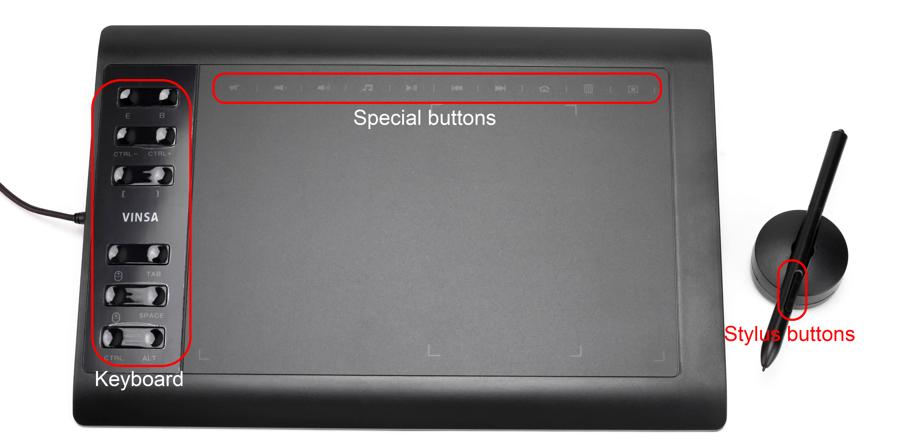

# Open-source Vinsa graphical tablet (based on T501 chip) Driver for Linux

This is an open-source driver for Vinsa graphical tablets based on the T501 chip, designed to work with Linux operating systems. 
The driver provides support for various models of Vinsa tablets, enabling features such as pressure sensitivity, tilt recognition, and customizable button mappings.

### ⚠️ This driver are tested only on the SWB011BK model (also known as Vinsa VIN 1060 Plus). Other models may or may not work properly.

Also, this driver is still in development and may contain bugs or incomplete features.

This graphical tablet looks like this...



## Features

1. Supports full area of the tablet (not limited as Android device).
2. Pressure sensitivity support.
3. Tilt recognition support.
4. Supports all pen buttons.
5. Customizable button mappings (on the tablet keyboard).
6. Supports special buttons (e.g., mute, volume up/down etc).
    - This buttons can be scripted to perform any action (for example, you can emulate keyboard input or run a bash script).
7. All-in-one driver (native library + Java application). Program automatically extracts and loads native library.
8. Works on most Linux distributions.
9. The driver does not detach the tablet’s built-in storage (often used to store Windows drivers and manuals). 
I don't know how you can use this, but it can.
10. Automatically fetches keycodes from your system.
11. Easy to install and configure.

## Installation

This driver written on Java and use native library via JNI to emulate USB HID device.

### Prerequisites
- Java Runtime Environment (JRE) 21 or higher.
- LibUsb library installed on your system.

### Steps to install
1. Download the latest JAR file from release from the [Releases](https://github.com/aloyen07/vinsa-t501-driver/releases) page.
2. Install all required dependencies
Debian / Ubuntu / Linux Mint:
```shell
sudo apt update && sudo apt upgrade
sudo apt install libusb-1.0.0 openjdk-21-jre
```
Fedora / RHEL / CentOS:
```shell
sudo dnf update
sudo dnf install libusb1 openjdk-21
```
Arch / Manjaro:
```shell
sudo pacman -Syu
sudo pacman -S libusb jre-openjdk
```
openSUSE:
```shell
sudo zypper refresh
sudo zypper install libusb-1_0-0 java-21-openjdk
```
3. Open terminal and navigate to the directory where you downloaded the JAR file.
4. Run the driver with superuser privileges (required to access USB devices):
```shell
sudo java -Djava.library.path=native/ru/aloyenz/t501/driver/virtual/ -jar VinsaT501Driver-1.0.0-BETA-all.jar
```
5. Enjoy using your graphical tablet on Linux!

## Troubleshooting

1. If the driver does not starting or crashes with SEGFAULT or other Java native error, make sure you have installed the 
correct version of the LibUsb library (1.0.0 or higher), or try loading the uinput kernel module via `sudo modprobe uinput`
2. If the driver crashes with permission denied error, make sure that you are running the driver with superuser 
privileges (using `sudo`), or, you can connect your tablet, change permission for the device file via `udev` rules or just give 
permission manually to the device file: `chown -R <your user> /dev/bus/usb/*/*`. You can replace wildcards with your bus and device numbers.
3. If driver not starts, make sure that you defined correct path to native library via `-Djava.library.path` parameter. It's very important.

## Building

This project uses native C files for the JNI interface and Java files for the main driver logic. By default, in the repository,
this natives are precompiled for x86_64 architecture. If you want to build the project from source, follow these steps:

1. Install JDK 21, Git, GCC, libusb development and linux headers packages.
Ubuntu / Debian:
```shell
sudo apt update && sudo apt upgrade
sudo apt install openjdk-21-jdk gcc libusb-1.0-0-dev linux-headers-$(uname -r) git
```
Fedora / RHEL / CentOS:
```shell
sudo dnf update
sudo dnf install java-21-openjdk-devel gcc libusbx-devel kernel-headers kernel-devel git
```
Arch / Manjaro:
```shell
sudo pacman -Syu
sudo pacman -S jdk21-openjdk gcc libusb linux-headers git
```
openSUSE:
```shell
sudo zypper refresh
sudo zypper install java-21-openjdk-devel gcc libusb-1_0-0-devel kernel-devel git
```
2. Clone this repository and navigate to the project directory:
```shell
git clone https://github.com/aloyen07/vinsa-t501-driver.git
cd vinsa-t501-driver
```
3. Build the JAR file using Gradle:
```shell
chmod +x gradlew
./gradlew clean shadowJar
```
4. The built JAR file will be located in the `build/libs/` directory.

## Configuration

Program arguments:
- `--config <file>` - specify path to configuration file (default: `config.json` in the current directory).
- `--keycodes-cache <file>` - specify path to keycodes cache file (default: `keycodes.json` in the current directory).
- `--user-headers <file>` - specify path to user headers file (default: `/usr/include/linux/input-event-codes.h`). Uses for fetching keycodes.
- `--native-lib-path-prefix <path>` - specify path prefix to native library for extraction (NOT FOR LOADING!). Default: `native/ru/aloyenz/t501/driver/virtual/`.
- `--force-fetch-keycodes` - force fetching keycodes from user headers file, even if keycodes cache file exists.

Program creates two files in the current directory by default:
- `t501-driver-config.json` - main configuration file. You can edit it to customize button mappings and other settings.
- `keycodes.json` - cache file for fetched keycodes. You can delete it to force re-fetching keycodes from user headers file or edit to modify key codes mappings.

## Tested on...
- Ubuntu 24.04 LTS
- Kali Linux 2025.3

## TODO

1. Graphical User Interface (GUI) for easier configuration.
2. Automatic installation script (for daemonizing the driver on system startup).
3. User keymaps to remap pen buttons.

## Contributing

Contributions are welcome! If you find a bug or want to add a new feature, please open an issue or submit a pull request 
on the [GitHub repository](https://github.com/aloyen07/vinsa-t501-driver).

## License

This project is licensed under the **GNU General Public License v3.0 (GPLv3)**.  
You are free to use, modify, and distribute this software — even commercially —  
as long as all modified versions and derivative works remain open-source  
and are distributed under the same license.

See the [LICENSE](LICENSE) file for more details.